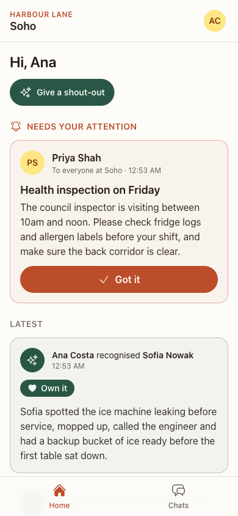
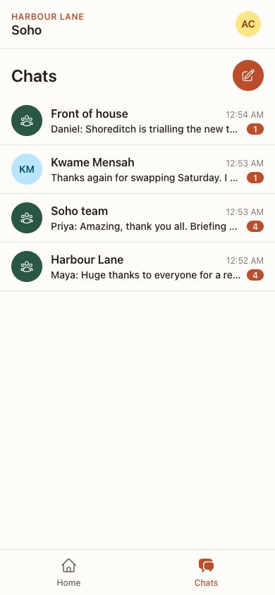
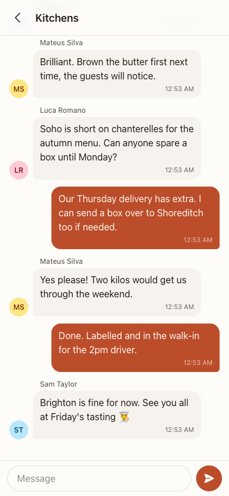
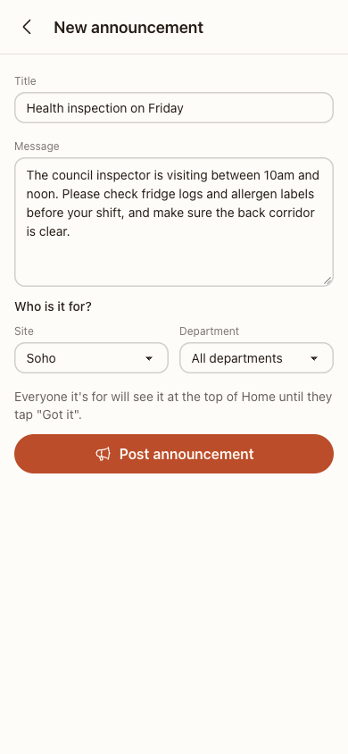
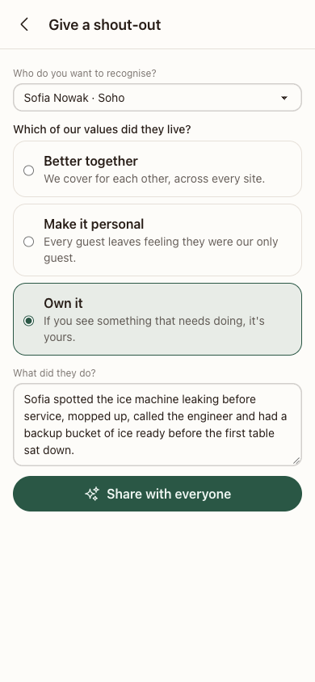

# Sona

Sona is a proof of concept for a team app for multi-site hospitality businesses: restaurant groups, hotels, pubs. It's built to replace the WhatsApp groups frontline teams run on today. It also gives the company a way to reach everyone with the things that matter.

<p>
  
  
  
  
  
</p>

## The problem, as I see it

Hospitality teams already talk on WhatsApp, and it mostly works, until it doesn't:

- **Groups are built by hand.** New starters miss things, and people who left are still in the kitchen group months later.
- **Personal numbers are shared.** Everyone's number is out there.
- **Important posts get lost.** "The rota changed" or "fridge 2 is broken" scrolls away under the chatter, and nobody can tell who actually saw it.

The other half of the brief, helping people feel part of something bigger, usually gets an intranet or a company feed as its answer. Those die quietly, because nobody opens them.

So the bet in this POC is that **chat is the daily habit, and the important stuff should ride on it**:

1. Build the chat properly.
2. Make it know the org chart.
3. Put a small, separate lane next to it for announcements people acknowledge, and for shout-outs that tie someone's work to the company's values.

The reasoning, including the other five shapes I considered and why they lost, is in [docs/architecture.md](docs/architecture.md) (D-002).

## What's in it

- **Channels that follow the org chart:**
  - **Audiences:** a channel, like an announcement, is for an *audience*. That's one site or every site, crossed with one department or every department.
  - **Membership:** who's in it is worked out from the org chart when you look. New starters see their channels on day one, and leavers lose access straight away. Nobody manages members by hand.
- **Direct messages:** between any two colleagues, without swapping phone numbers.
- **Real time:** messages, posts and unread counts update live.
- **Announcements:** managers post to an audience. Each one stays at the top of Home, under "Needs your attention", until you tap "Got it". That records who acknowledged it and when.
- **Shout-outs:** anyone can recognise a colleague for living one of the company's values, and the whole company sees it.
- **Multi-company from day one:**
  - **Isolation:** every company's data is fenced off by the scope in each query, and by composite foreign keys in the database.
  - **Offboarding:** ends someone's access at once, open tabs included. It's a console action for now; the button belongs in the manager view.

It's designed for phones first, because the people using it are on their feet, not at desks. It's a single Phoenix LiveView app.

## Try it

You'll need:

- **Erlang and Elixir:** the versions are in `.tool-versions`, and `mise install` sets them up.
- **Postgres:** with the default `postgres`/`postgres` user.

```bash
mix setup          # deps, database, demo data, assets
mix phx.server     # http://localhost:4000
```

**Signing in:** open **http://localhost:4000/dev/personas** and pick someone. That page is a dev-only shortcut and never compiles into production. The real sign-in is a magic link at `/users/log-in`, and in dev the emails land at `/dev/mailbox`.

**The demo data:**

- **Harbour Lane:** a made-up group with a head office and sites in Soho, Shoreditch and Brighton, and 15 people.
- **Northfield Inns:** a second company that can't see any of it.

**Two people at once:** to watch real time between two people, each one needs their own cookies. Use a normal window and a private one, or two browser profiles.

A five-minute tour:

1. **Different people, different channels.** **Ana Costa** (front of house, Soho) and **Kwame Mensah** (kitchen, Soho) see different channels; compare their Chats tabs. Both start with unread messages.
2. **Real-time chat.** Open *Soho team* as both of them and talk. Messages, previews and unread badges update live.
3. **A direct message.** As Ana, tap the pencil in Chats and message Kwame. It pops up at the top of his list.
4. **An announcement.** As **Priya Shah** (a Soho manager): Home → *Announce* → Soho.
   - It appears under "Needs your attention" for everyone at Soho, and nowhere else.
   - Tap *Got it* as Ana, and it moves into her feed.
5. **A shout-out.** As Ana, use *Give a shout-out* to recognise Sofia for "Own it". **Elena Popescu**, in housekeeping in Brighton, sees it arrive.
6. **Another company.** Sign in as **Ruth Barker** from Northfield Inns. None of the above exists for her.

`mix ecto.reset` puts the demo data back.

## How it's built

- **One app:** Phoenix 1.8 with LiveView, Postgres and Tailwind. There's no separate frontend and no extra infrastructure; real-time updates go through Phoenix PubSub.
- **Four contexts:**
  - `Accounts`: the generated auth.
  - `Companies`: company → site → team member, and the audience rule.
  - `Chat` and `Feed`: both build on `Companies`, and never on each other.
- **Scope:** the signed-in person's team member travels in the scope, and every query on company data filters by it. Any id that comes from the browser is looked up again through the scope.
- **Real-time topics are safe by construction.** You only subscribe to conversations you could load, and each post goes out on a topic named after its audience, so a broadcast can't reach the wrong person.
- **The database enforces the rules too:**
  - **Company boundaries:** composite foreign keys keep every reference inside one company.
  - **Valid shapes:** check constraints say what a valid channel, direct conversation, announcement or shout-out looks like.

The decisions (D-001 to D-007), data model, glossary and open questions are all in [docs/architecture.md](docs/architecture.md).

## How I worked with AI

I built all of it with Claude Code, in a deliberate loop rather than one big prompt:

1. **Harness first.**
   - **[AGENTS.md](AGENTS.md):** the rules any coding agent follows, such as test-first, scoped queries and no mocking our own code.
   - **[CLAUDE.md](CLAUDE.md):** adds the Claude Code workflow.
   - **The [commit gate](.claude/hooks/commit-gate.sh):** stops a commit until the agent confirms, with `COMMIT_REVIEWED=1`, that precommit ran, the docs were checked and a fresh-context review happened.
2. **Design before code.** The agent laid out six product shapes with their trade-offs. I picked one, and the decisions went into the architecture doc before any code was written. The [build plan](docs/plans/2026-10-06-poc.md) split the work into eleven steps.
3. **Test-first, then a second pair of eyes.**
   - **Tests first:** each step started with failing tests.
   - **Fresh-context review:** before each commit, a separate agent that hadn't seen the work reviewed the staged diff against the [`sona-review`](.claude/skills/sona-review/SKILL.md) checklist. The reviewers mutated code to find tests that couldn't fail, and ran `EXPLAIN ANALYZE` on generated data.
   - **What they caught:** a race that could lose a message, an announcement the database would accept without a title, unread counts that scanned whole channels, and a formatter cache that let unformatted code through precommit.
4. **A real browser.**
   - **Every step:** each new screen was checked in Playwright at phone size, with two people signed in at once for anything real-time.
   - **A final QA run:** an agent drove up to 11 people at once through the whole app. It found four more bugs, which I fixed before opening the PR.
5. **Parallel where it was safe.** Reviews and browser runs went to background agents while the next step's tests were written.

The [session logs](docs/sessions/) summarise each working session: what was decided, what was built, and what the reviews caught.

## What's next

- **Shift-awareness.** Sona's scheduling product already owns the rota, so the obvious next step is communication that knows who's working:
  - "on shift now" audiences;
  - pre-shift briefings;
  - quiet hours that hold non-urgent messages until your next shift.
- **A manager view:** who hasn't acknowledged an announcement yet, and inviting and offboarding people.
- **Push notifications and phone-number sign-in:** the two biggest gaps before this could really replace WhatsApp.
